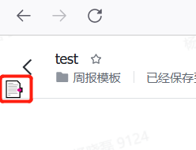
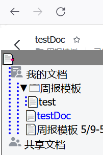

在飞书的文档查看页面看到文件列表

在飞书的文档编辑界面可以快速显示和定位到文件所在目录，点击 左上角的图标即可
自动展开功能支持4种文件格式，可在文件地址栏上判断，如有新格式可以自行添加
    let typeList = {
        file: 12,
        mindnotes: 11,
        sheets: 3,
        docs: 2,
    }

